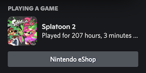
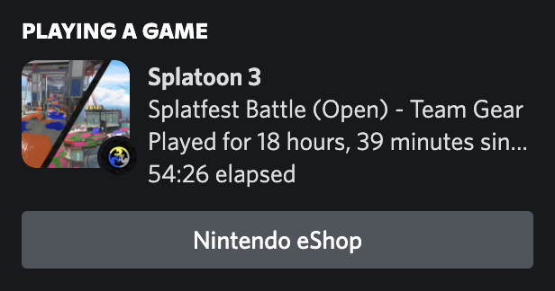
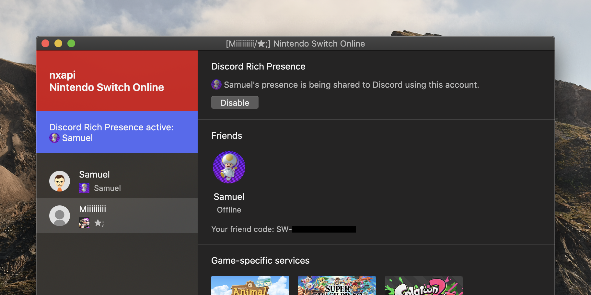

nxapi
===

JavaScript library and command line and Electron app for accessing the Nintendo Switch Online and Nintendo Switch Parental Controls app APIs. Show your Nintendo Switch presence in Discord, get friend notifications on desktop, and download and access SplatNet 2, NookLink, SplatNet 3 and Parental Controls data.

[](https://discord.com/invite/4D82rFkXRv)

### Features

- Command line and Electron app interfaces
- Interactive Nintendo Account login for the Nintendo Switch Online and Nintendo Switch Parental Controls apps
- Automated login to the Nintendo Switch Online app API
    - This uses the [api.imink.app](https://github.com/imink-app/f-API) or
        [nxapi-znca-api.fancy.org.uk](https://github.com/samuelthomas2774/nxapi-znca-api) API by default.
    - Alternatively a custom server can be used.
    - A custom server using a rooted Android device/emulator is included.
- Get Nintendo Switch account information, friends list and game-specific services
- Show Discord Rich Presence using your Nintendo Switch presence
    - Fetch presence using a secondary account or from a custom URL.
    - Show your account's friend code (or a custom friend code).
    - All titles are supported using a default Nintendo Switch app. A limited number of titles have their own
        Discord apps (meaning they appear under your name with the title's name instead of "Nintendo Switch")
        or other custom Discord features. [See here for Discord title overrides](src/discord/titles) or
        [create an issue if you'd like another title added](https://github.com/samuelthomas2774/nxapi/issues/new/choose).

    

    - Additional presence information for Splatoon 3

        
- Show notifications for friend Nintendo Switch presences

    
- [Electron app] Open game-specific services
    - Including NookLink, which doesn't work in web browsers as it requires custom JavaScript APIs.
- Nintendo Switch Online app API proxy server and presence server
    - This allows a single account to fetch presence for multiple users.
    - Data will be cached for a short time to reduce the number of requests to Nintendo's server.
    - This automatically handles authentication when given a Nintendo Account session token. This makes it much
        easier to access the API from a browser, in scripts or in other software.
- Download all personalised SplatNet 2 and SplatNet 3 data, including battle and Salmon Run results
- Download island newspapers from and send messages and reactions using NookLink
- Download all Nintendo Switch Parental Controls usage records

The API library and types are exported for use in JavaScript/TypeScript software. The app/commands properly cache access tokens and try to handle requests to appear as Nintendo's apps - if using nxapi as a library you will need to handle this yourself. [More information.](#usage-as-a-typescriptjavascript-library)

#### Electron app

nxapi includes an Electron app, which can be downloaded [here](https://github.com/samuelthomas2774/nxapi/releases). The app can be used to:

- Login to a Nintendo Account, both for the Nintendo Switch Online app and Parental Controls app
    - This will open the Nintendo Account login page in the app, just like signing into Nintendo's own apps.
    - The Nintendo Account authorisation page can be opened in a browser by holding <kbd>Shift</kbd> while pressing add account.
    - Accounts are shared with the nxapi command line interface.
- Share Nintendo Switch presence to Discord
    - Using a custom presence URL or a friend's presence is supported.
    - Using the authenticated user's presence is not supported, as this is no longer available from the API ([#1](https://github.com/samuelthomas2774/nxapi/issues/1)).
- Showing notifications for friend presences
    - Multiple users can be selected.
- Access game-specific services
    - These will be opened in the app.




The app includes the nxapi command line at `dist/bundle/cli-bundle.js`. Node.js must be installed separately to use this.

```sh
# macOS
node Nintendo\ Switch\ Online.app/Contents/Resources/app/dist/bundle/cli-bundle.js ...

# Windows
node 'Nintendo Switch Online/resources/app/dist/bundle/cli-bundle.js' ...

# Linux, installed via dpkg
node /opt/Nintendo\ Switch\ Online/resources/app/dist/bundle/cli-bundle.js ...
```

#### Do I need a Nintendo Switch Online membership?

No.

The only requirement to use this is that your Nintendo Account is linked to a Network Service Account, i.e. you've linked your Nintendo Account to a Nintendo Switch console at some point. It doesn't matter if your account is no longer linked to any console.

You will need to have an online membership (free trial is ok) to use any game-specific services if you want to access those. SplatNet 2 can be used without an active membership, but NookLink and Smash World both require an active membership just to open them.

For Parental Controls data, you don't need to have linked your account to a console. You will need to use Nintendo's app to add a console to your account though, as this isn't supported in nxapi and the Parental Controls API is a bit useless without doing this.

#### Will my Nintendo Switch console be banned for using this?

No.

#### Will my Nintendo Account/Network Service Account be banned for using this?

It's extremely unlikely:

- Other projects (e.g. splatnet2statink, splatoon2.ink) have used the same reverse engineered APIs for a long time (pretty much since they've existed) and no one has ever been banned for using them. splatnet2statink in monitoring mode updates every 5 minutes by default - monitoring commands (Discord presence, friend notifications and SplatNet 2/SplatNet 3 monitoring) in nxapi only update slightly more frequently (every 1 minute), so there's not much higher risk than using splatnet2statink.
- Unlike console bans, account bans would prevent you from accessing digital content or online services you've paid for. (If your console was banned you'd still be able to use it and you could just buy another one to access your account.)
- Nintendo can't stop you watching their app's network activity, which is all the reverse engineering required to develop this.

A secondary account is required for Discord Rich Presence; you don't need to sign in to your main account.

#### Why is a token sent to one/two different non-Nintendo servers?

It's required to generate some data to make Nintendo think you're using the real Nintendo Switch Online app, as currently it's too hard to do this locally. (This isn't required for Parental Controls data.) See the [Coral client authentication](#coral-client-authentication) section below for more information.

#### I need help using nxapi or Nintendo's APIs/I want to share something I've made using nxapi or Nintendo's APIs

I've created a Discord server for this project. Anyone interested in Nintendo's smart device app APIs is welcome to join, even if you're not interested in this project.

If you are creating something using Nintendo's smart device APIs: updates to Nintendo's apps are published in [#nintendo-app-versions](https://discord.com/channels/998657768594608138/998659415462916166).

Invitation: https://discord.com/invite/4D82rFkXRv

### Install

#### Install with npm

Node.js and npm must already be installed.

```sh
# From registry.npmjs.com
npm install --global nxapi

# From gitlab.fancy.org.uk
npm install --global --registry https://gitlab.fancy.org.uk/api/v4/packages/npm/ @samuel/nxapi

# From npm.pkg.github.com
npm install --global --registry https://npm.pkg.github.com @samuelthomas2774/nxapi

# From gitlab.com
npm install --global --registry https://gitlab.com/api/v4/packages/npm/ @samuelthomas2774/nxapi
```

#### Install from source

Node.js and npm must already be installed.

```sh
# Don't download an archive, as nxapi detects the current git revision
git clone https://gitlab.fancy.org.uk/samuel/nxapi.git
cd nxapi

# Install CLI/Electron app locally
npm install
npx tsc

# CLI
# This command installs the nxapi command globally
# You can also use the CLI with node bin/nxapi.js ...
npm link

# Electron app
npx rollup --config
# nxapi app or node bin/nxapi.js app to run the app

# Build Docker image
docker build . --tag registry.fancy.org.uk/samuel/nxapi
# # Run in Docker
# docker run -it --rm -v ./data:/data registry.fancy.org.uk/samuel/nxapi ...
```

### Usage

Information on the nxapi command line interface can be found at [docs/cli.md](docs/cli.md).

The information below is relevant to both the Electron app and command line. Some environment variables are also used when using nxapi as a JavaScript library.

#### Data location

Data will be stored in an OS-specific local data location by default in the `nxapi-nodejs` directory.

```sh
# Store data in ./data
nxapi --data-path ./data ...
NXAPI_DATA_PATH=`pwd`/data nxapi ...
```

Platform        | Default path
----------------|----------------
macOS           | `Library/Application Support/nxapi-nodejs`
Windows         | `%localappdata%\nxapi-nodejs\Data`
Linux           | `$XDG_DATA_HOME/nxapi-nodejs` or `.local/share/nxapi-nodejs`

nxapi will also store cached update and configuration data. This location cannot be changed.

Platform        | Cache path
----------------|----------------
macOS           | `Library/Caches/nxapi-nodejs`
Windows         | `%localappdata%\nxapi-nodejs\Cache`
Linux           | `$XDG_CACHE_HOME/nxapi-nodejs` or `.cache/nxapi-nodejs`

The Electron app will also store other data in various locations.

#### Debug logs

Logging uses the [debug](https://github.com/debug-js/debug) package and can be controlled using the `DEBUG` environment variable. All nxapi logging uses the `nxapi`, `cli` and `app` namespaces.

```sh
# Show all debug logs from nxapi
DEBUG=nxapi:*,cli,cli:* nxapi ...

# Start the Electron app and show all debug logs from nxapi
DEBUG=nxapi:*,app,app:* nxapi app
DEBUG=nxapi:*,app,app:* .../Nintendo\ Switch\ Online.app/Contents/MacOS/Nintendo\ Switch\ Online

# Show all API requests
DEBUG=nxapi:api:* nxapi ...

# Show all debug logs
DEBUG=* nxapi ...
```

#### Environment variables

Some options can be set using environment variables. These can be stored in a `.env` file in the data location. Environment variables will be read from the `.env` file in the default location, then the `.env` file in `NXAPI_DATA_PATH` location. `.env` files will not be read from the location set in the `--data-path` option.

This can be used with the Electron app (including when using the packaged version).

nxapi doesn't store any data itself when used as a TypeScript/JavaScript library, and doesn't attempt to read any `.env` files, however environment variables will still be used. If you want to read environment variables from a file you can use the [dotenv](https://github.com/motdotla/dotenv) and [dotenv-expand](https://github.com/motdotla/dotenv-expand) packages, or run `source .env` before running your process.

Environment variable            | Description
--------------------------------|-------------
`NXAPI_DATA_PATH`               | Sets the location to store user data. See [data location](#data-location).
`ZNC_PROXY_URL`                 | Sets the URL of the nxapi znc API proxy server. See [API proxy server](docs/cli.md#api-proxy-server).
`NXAPI_ZNCA_API`                | Sets the API to use for Coral client authentication. Either `flapg` or `imink`. See [Coral client authentication](#coral-client-authentication).
`ZNCA_API_URL`                  | Sets the URL of the nxapi znca API server to use for Coral client authentication, if `NXAPI_ZNCA_API` is not set. See https://gitlab.fancy.org.uk/samuel/nxapi-znca-api or https://github.com/samuelthomas2774/nxapi-znca-api.
`NXAPI_USER_AGENT`              | Sets the application/script user agent string used by the nxapi command. See [user agent strings](#user-agent-strings).
`NXAPI_ENABLE_REMOTE_CONFIG`    | Disables fetching and using remote configuration data if set to `0`. Do not disable remote configuration if nxapi has run with it enabled.
`NXAPI_REMOTE_CONFIG_FALLBACK`  | Allows using local configuration data if the remote configuration data cannot be fetched if set to `1`. This should not be used, as it can cause nxapi to revert to local configuration data after previously using newer remote configuration data.
`NXAPI_CONFIG_URL`              | Sets the URL to fetch remote configuration data from.
`NXAPI_SKIP_UPDATE_CHECK`       | Disables the update check in the nxapi command and the Electron app if set to `1`.
`NXAPI_SPLATNET3_UPGRADE_QUERIES` | Sets when the SplatNet 3 client is allowed to upgrade persisted query IDs to newer versions. If `0` queries are never upgraded (not recommended). If `1` queries are upgraded if they do not contain potentially breaking changes (not recommended, as like `0` this allows older queries to be sent to the API). If `2` queries are upgraded, requests that would include breaking changes are rejected. If `3` all queries are upgraded, even if they contain potentially breaking changes (default).
`NXAPI_SPLATNET3_STRICT`        | Disables strict handling of errors from the SplatNet 3 GraphQL API if set to `0`. If set to `1` (default) requests will be rejected if the response includes any errors, even if the response includes a result.
`DEBUG`                         | Used by the [debug](https://github.com/debug-js/debug) package. Sets which modules should have debug logging enabled. See [debug logs](#debug-logs).

Other environment variables may also be used by Node.js, Electron or other packages nxapi depends on.

#### User agent strings

As nxapi can be used in scripts or as a library, it exposes a few different methods for setting a user agent string for requests to the imink, flapg and other non-Nintendo APIs. You must include the name and version number of your script/program in the user agent. If your program is not open source or not easily discoverable (e.g. by searching GitHub) it must also include contact information.

When using the nxapi command in a script or other program, the `NXAPI_USER_AGENT` environment variable should be used. The `NXAPI_USER_AGENT` environment variable is only used by the nxapi command, and will be ignored by the Electron app or when using nxapi as a library.

```sh
export NXAPI_USER_AGENT="your-script/1.0.0 (+https://github.com/...)"
nxapi nso ...
```

When using nxapi as a TypeScript/JavaScript library, the `addUserAgent` function should be used.

```ts
import { addUserAgent } from 'nxapi';

addUserAgent('your-script/1.0.0 (+https://github.com/...)');
```

The `addUserAgentFromPackageJson` function can be used to add data from a package.json file.

```ts
import { addUserAgentFromPackageJson } from 'nxapi';

await addUserAgentFromPackageJson(new URL('../package.json', import.meta.url));
await addUserAgentFromPackageJson(path.resolve(fileURLToString(import.meta.url), '..', 'package.json'));
// adds "test-package/0.1.0 (+https://github.com/ghost/example.git)"

await addUserAgentFromPackageJson(new URL('../package.json', import.meta.url), 'additional information');
// adds "test-package/0.1.0 (+https://github.com/ghost/example.git; additional information)"
```

### Usage as a TypeScript/JavaScript library

nxapi exports it's API library and types.

See [docs/lib](docs/lib/index.md) and [src/exports](src/exports).

<a name="splatnet2statink-and-flapg"></a>

### Coral client authentication

[api.imink.app](https://github.com/JoneWang/imink/wiki/imink-API-Documentation) or [nxapi-znca-api.fancy.org.uk](https://github.com/samuelthomas2774/nxapi-znca-api) is used by default to automate authenticating to the Nintendo Switch Online app's API and authenticating to web services. An access token (`id_token`) created by Nintendo must be sent to this API to generate some data that is required to authenticate the app. This API runs the Nintendo Switch Online app on an Android device to generate this data. The access token sent includes some information about the authenticated Nintendo Account and can be used to authenticate to the Nintendo Switch Online app and web services.

Specifically, the tokens sent are JSON Web Tokens. The token sent to login to the app includes [this information and is valid for 15 minutes](https://gitlab.fancy.org.uk/samuel/nxapi/-/wikis/Nintendo-tokens#nintendo-account-id_token), and the token sent to login to web services includes [this information and is valid for two hours](https://gitlab.fancy.org.uk/samuel/nxapi/-/wikis/Nintendo-tokens#nintendo-switch-online-app-token).

Alternatively the [flapg API](https://twitter.com/NexusMine/status/1563728086322929665) can be used by setting the `NXAPI_ZNCA_API` environment variable to `flapg`. (`NXAPI_ZNCA_API=flapg nxapi nso ...`)

> Since v1.3.0 the default API to use will be fetched from my server and can be changed without an update to nxapi. To force the use of the imink API, set the `NXAPI_ZNCA_API` environment variable to `imink`.

nxapi also includes a custom server using Frida on an Android device/emulator that can be used instead of these.

This is only required for Nintendo Switch Online app data. Nintendo Switch Parental Controls data can be fetched without sending an access token to a third-party API.

This is really annoying. Initially the Nintendo Switch Online app didn't perform any sort of client attestation at all, then Nintendo added a HMAC of the id_token, timestamp and request ID to app/web service login requests, using a secret key embedded in the app, which was soon discovered. Nintendo later updated the app to use a native library (`libvoip`, which is also used for the app's VoIP features) to do this, and still no one knows how it works. (To make things even more confusing, the function, `gen_audio_h`/`gen_audio_h2`, always returns a different result, even when given the same inputs.)

The reason Nintendo added this is probably to try and stop people automating access to their app's API. I really hope that's wrong though, as then Nintendo would be prioritising that over account security, as most people seem ok with sharing account credentials to access the API. (And it's not stopping anyone accessing the API outside of the app anyway.)

[**See #10 if you can help with this.**](https://github.com/samuelthomas2774/nxapi/discussions/10)

### Resources

- Nintendo Switch Online app API docs
    - https://github.com/ZekeSnider/NintendoSwitchRESTAPI
    - https://dev.to/mathewthe2/intro-to-nintendo-switch-rest-api-2cm7
    - nxapi includes TypeScript definitions of all API resources and JSON Web Token payloads at [src/api](src/api)
- Coral client authentication (`f` parameter)
    - https://github.com/samuelthomas2774/nxapi/discussions/10
    - ~~https://github.com/frozenpandaman/splatnet2statink/wiki/api-docs - splatnet2statink and flapg API docs~~
    - https://github.com/JoneWang/imink/wiki/imink-API-Documentation - imink API docs
- HTTP debugging proxies
    - Proxyman - https://proxyman.io
    - mitmproxy - https://mitmproxy.org
- HTTP clients
    - Paw - https://paw.cloud
- Disabling TLS certificate validation (entirely) with Frida on Android
    - https://httptoolkit.tech/blog/frida-certificate-pinning/
- Other Discord Rich Presence implementations (that use Coral)
    - https://github.com/MCMi460/NSO-RPC
    - https://github.com/Quark064/NSO-Discord-Integration
    - https://github.com/AAGaming00/acnhrp - doesn't use Coral, instead attempts to send a message in Animal Crossing: New Horizons every 10 seconds to check if the user is playing that game online
- Other projects using Coral/web services
    - (Due to frequent breaking changes to Nintendo's API many of these do not work. In particular anything not updated since [23/08/2022](https://github.com/samuelthomas2774/nxapi/discussions/10#discussioncomment-3464443) will not be able to authenticate to Nintendo's API.)
    - https://github.com/frozenpandaman/splatnet2statink
    - https://github.com/subnode/LoungeDesktop
    - https://github.com/dqn/gonso
    - https://github.com/clovervidia/splatnet-datagrabber
    - https://github.com/mizuyoukanao/ACNH_Chat_Client
    - https://github.com/dqn/acnh
    - ... plus many more - [search GitHub for znc.srv.nintendo.net](https://github.com/search?q=znc.srv.nintendo.net&type=code)
